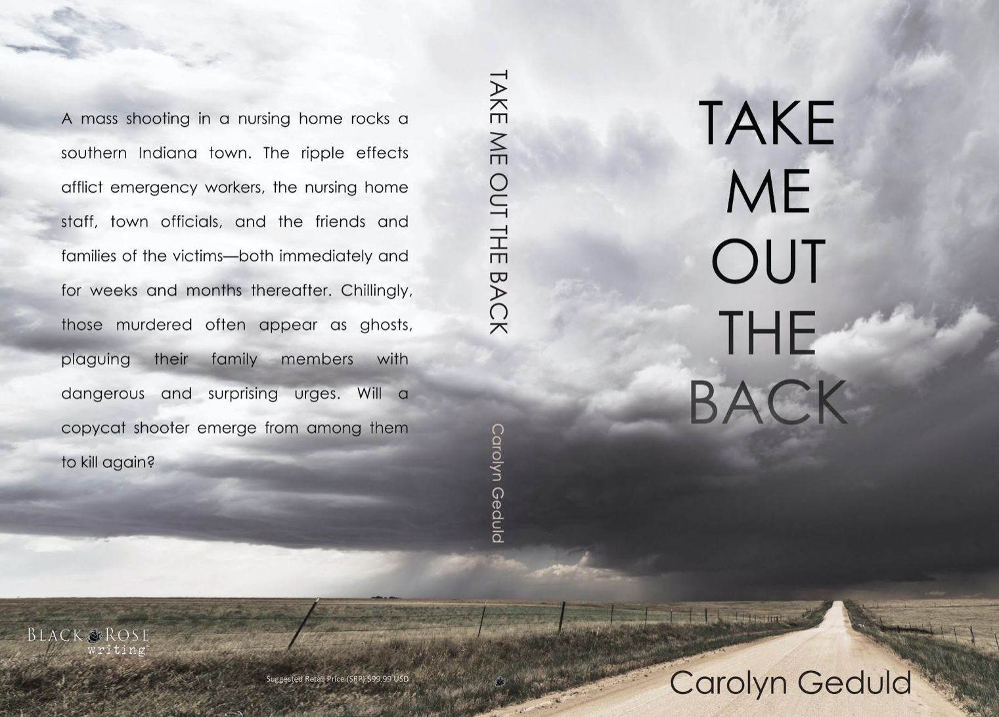

---
cover: true
image: /assets/img/hydejack-8.png
hide_description: true
---
## Welcome to my website. 

I write psychological fiction for adults, sometimes injected with humor. You can find me on [Facebook](https://www.facebook.com/Carolyn-Geduld-Author-112047537150330), [Twitter](https://twitter.com/CarolynGeduld), [Amazon](https://www.amazon.com/author/carolyngeduld), (and Goodreads](https://www.goodreads.com/author/show/100316.Carolyn_Geduld)

[Pre-order my first novel, *Take Me Out The Back* before August 27, 2020](https://www.amazon.com/Take-Out-Back-Carolyn-Geduld/dp/1684335094/ref=sr_1_1?crid=11ADTU82RLW5&dchild=1&keywords=take+me+out+the+back&qid=1596908521&s=books&sprefix=Take+me+out+%2Caps%2C164&sr=1-1)
### Advanced Praise

"A truly unique and chilling account of a mass killing as seen through the eyes of many." -Sublime Book Review

"TAKE ME OUT THE BACK is a taut, engrossing and talented debut novel that provides a mosaic of perspectives on a mental health horror story." -IndieReview
### My Work in Progress

"Who Shall Live: a Novel"

Why are firstborn children disappearing from the Jewish Community in a small Indiana university town in the time of Covid-19? Are they hidden in the surrounding forest? Why are so many others in the Community suffering from the fates listed in an ancient Jewish poem, Unetaneh Tokef?

"Oblivious: Stories of Racism and White Privilege"
### My Background

I am a mental health professional in Bloomington, Indiana, originally from NewYork City. I have degrees from The City College of New York and Indiana University.

